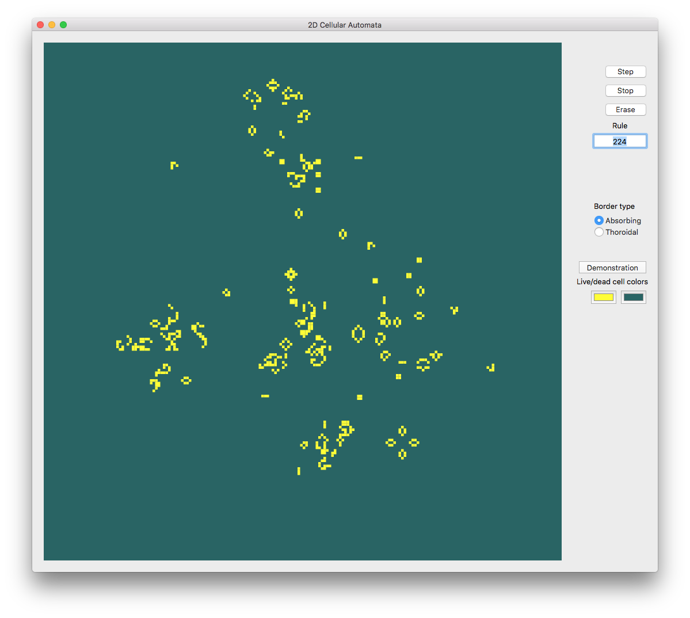
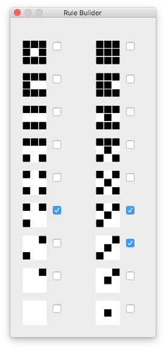

# Table of Contents

1.  [Introduction](#org22c4e30)
2.  [The main screen](#orgd021f03)
3.  [The pattern builder](#org287f913)

# Introduction

The project was inspired by the phenomenological analysis of 2D Cellular Automata rules in [A New Kind of Science](https://www.wolframscience.com/) by Stephen Wolfram. I needed a simple tool of exploration that allowed for quick pattern drawing and change of automata rule on the fly.

# The main screen

# The pattern builder

